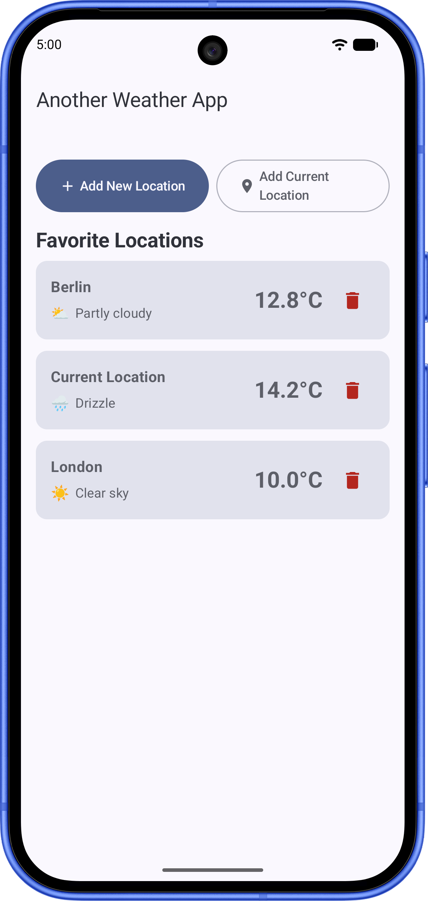

<div class="text-left">

# Shift Left

</div>

<div class="text-center my-12 text-2xl font-medium leading-relaxed">

Unit test your compose UI with reusable robots and BDD-style DSL

</div>

<div class="flex items-end justify-between mt-8">
  

  <div class="text-right opacity-75 text-base">
    Iulia STANA<br>
    Senior Android Developer<br>
    Dawn Technology
  </div>
</div>

<!--
Hello all, welcome!
Hope you've had a nice lunch, haven't yet hit the post lunch dip and are ready to dive in. How many
of you are developers? QA?

I am Iulia, a Senior Android Developer at Dawn Technology and I wanna talk to you about testing.
-->

---
layout: image-right
# show image on right
image: https://cover.sli.dev
transition: slide-up
---

# Confession

- ❌ Ownership
- ❌ Original
- ❌ Panacea

<div v-click class="mt-12">

- Compose
- JUnit
- Reusable

</div>

<!--
But first, I have to make a confession: I do not claim ownership of the DSL idea in this presentation. No, not
because AI made it, though it did do alot of the grunt work. But because this approach to testing is
something I learned & saw put in practice at my previous employer. People far smarter than me came
up with it, worked on it relentlessly, for months, until we had such high confidence in our tests we
could publish on Friday without worries. QA went from 6+ hours to less than 2h, on instrumented
tests.

My tiny contribution to this? I brought the approach to compose UI and focused on unit testing,
rather than instrumentation.

Since I learned this, I've applied & reused different parts of this testing approach, but
never everything at the same time. That is why, I want to issue a warning: this solution is not for everyone. Team size matters, available
time, maturity & discipline are critical!

For that reason: take the idea, adapt it and make it yours in the way that works FOR YOU.
-->

---

# Why?

Project constraints: CI build time, (defunct) firebase test lab access, cost
<div class="text-center">

<br>

## How far can I go with just unit testing?

</div>

---

# Unit testing vs. Instrumentation testing

- **Feedback**: fast vs. slow
- **Fidelity**: low vs. high
- **Environment**: local vs. device
- **Clock**: <span v-mark.circle.orange="1">autoAdvance vs. real world</span>

---

# Robolectric on JVM 17+ or SDK>30

```kotlin {4-6|*}
android {
    testOptions {
        unitTests.all {
            it.jvmArgs(
                "--add-opens=java.base/java.lang=ALL-UNNAMED",
                //...
            )
        }
    }
}
```

- **Instructions**: https://robolectric.org/getting-started/#running-with-java-17-and-higher

---
transition: slide-up
---

# Toy Weather App

<div class="flex items-center gap-8 mt-6">
  <div class="flex-1">
    <p class="text-xl leading-relaxed">
      Small weather app that shows favorites locations, can add/remove them and the weather details for a given location.
    </p>
  </div>
  <div class="flex-shrink-0">
    
  </div>
</div>

---

# Permission Flows

Don't check the system! Tests cannot interact with system prompts.

**Rule**: Don't try to verify that a prompt is _shown_ or _clicked_

Verify that it was **triggered** and control the **result**.

<br >
For direct grant/deny:

```kotlin {1,2|4,5|*}
val application = ApplicationProvider.getApplicationContext<Application>()
val shadowApp = shadowOf(application)

shadowApp.grantPermissions(Manifest.permission.CAMERA)
shadowApp.denyPermissions(Manifest.permission.ACCESS_FINE_LOCATION)
```

---

# Create our own ActivityResultRegistry

Receive the permission requests, return the results

```kotlin {1,5,12|2,3|*}
class PermissionPromptRegistry : ActivityResultRegistry(),
    ActivityResultRegistryOwner {
    override fun getActivityResultRegistry() = this

    override fun <I, O> onLaunch(
        requestCode: Int,
        contract: ActivityResultContract<I, O>,
        input: I,
        options: ActivityOptionsCompat?
    ) {
        //process permission request
        dispatchResult(requestCode, result)
    }
}
```

---

# Permission Unit Testing: Setup

```kotlin {1,3,4|*}
val registry = PermissionPromptRegistry()
composeTestRule.setContent {
    CompositionLocalProvider(
        LocalActivityResultRegistryOwner provides registry
    ) {
        AwaTheme {
            LocationPermissionScreen(onBackClick = {})
        }
    }
}
```

---

# Screen Unit Testing: Setup

JUnit starting from the `Screen` composable

```kotlin {1|3-4|9|10-15|*}
@RunWith(RobolectricTestRunner::class)
class FavoritesScreenTest {
    @get:Rule
    val composeTestRule = createComposeRule()

    @Test
    fun `given no favorites, screen displays empty state and action buttons`() {
        var lambdaCalled = false
        composeTestRule.setContent {
            AwaTheme {
                FavoritesScreen(
                    favorites = emptyList(),
                    onAddLocationClick = { lambdaCalled = true },
                    isLoadingLocation = false,
                    onAddCurrentLocationClick = {},
                    onLocationClick = {},
                    onRemoveFavorite = {},
                )
            }
        }
    }
}
```

---

# Screen Unit Testing - Verification

What can be verified on a `Screen` with a given state?

```kotlin {1|2|4,7-8|10|11-12}
composeTestRule.onNodeWithText("No Favorites Added")
    .assertIsDisplayed()

val addButton = composeTestRule.onNodeWithTag("favorite:add_button")
addButton.assertIsDisplayed()
    .assertIsEnabled()
    .assertHasClickAction()
    .assert(hasTraversalIndex(1f))

addButton.performClick()
// onAddLocationClick = { lambdaCalled = true },
assertTrue(lambdaCalled)

```

---
transition: fade
---
# Screen Unit Testing: Verdict

- basic state verification, accessibility + traversal index
- one step above screenshot testing
- no transitions or state modification
- lambda call check
- ~ previews
- Litmus state check

---
transition: slide-up
---
# Screen Unit Testing: Verdict

- basic state verification, accessibility + traversal index
- one step above screenshot testing
- no transitions or state modification
- lambda call check
- ~ previews
- Litmus state check

<div v-click.scale.fade class="absolute top-1/2 left-1/2 -translate-x-1/2 -translate-y-1/2 -rotate-12 pointer-events-none z-20 border-8 border-red-600/60 text-red-600/70 text-6xl font-black uppercase tracking-widest px-8 py-4 rounded-xl shadow-2xl backdrop-blur-sm select-none">
  Underwhelming!
</div>

---

# Change the System Under Test?

Move the test higher, at the `Route` composable

```kotlin{2,4,7}
@Composable
fun FavoritesRoute(
    modifier: Modifier = Modifier,
    viewModel: FavoritesViewModel = hiltViewModel()
) {
    val favorites by viewModel.favoritesState.collectAsStateWithLifecycle()
    FavoritesScreen(
        favorites = favorites,
        onAddLocationClick = viewModel::onAddLocationClick,
        onAddCurrentLocationClick = viewModel::addCurrentLocationToFavorites,
        onLocationClick = viewModel::onLocationClick,
        onRemoveFavorite = viewModel::removeFavorite,
        modifier = modifier
    )
}
```

---

# Route Unit Testing: Setup

More setup required: all `ViewModel` dependencies, but same compose rule

```kotlin {3-8|10-15|}
@Test
fun `given location is removed, location is not shown`() = runTest {
        val viewModel = FavoritesViewModel(
            favoritesRepository = fakeFavoritesRepo,
            weatherRepository = fakeWeatherRepo,
            locationTracker = fakeLocationTracker,
            navigator = navigator
        )

        composeTestRule.setContent {
            AwaTheme {
                FavoritesRoute(viewModel = viewModel)
            }
        }
    }
```

---
transition: fade
---

# Route Unit Testing: Verification

Can verify state transition in UI, with real `ViewModel` and fake data sources

```kotlin{1-2|4-5}
composeTestRule.onNodeWithContentDescription("Remove Favorite")
    .performClick()

composeTestRule.onNodeWithText("Berlin").assertDoesNotExist()
composeTestRule.onNodeWithText("No Favorites Added").assertIsDisplayed()
```

---

# Route Unit Testing: Verification

Can verify state transition in UI, with real `ViewModel` and fake data sources

```
composeTestRule.onNodeWithContentDescription("Remove Favorite")
    .performClick()

composeTestRule.onNodeWithText("Berlin").assertDoesNotExist()
composeTestRule.onNodeWithText("No Favorites Added").assertIsDisplayed()
```

<div v-click.scale.fade class="absolute top-1/2 left-1/2 -translate-x-1/2 -translate-y-1/2 -rotate-12 pointer-events-none z-20 text-red-600/70 text-6xl font-black uppercase tracking-widest px-8 py-4 rounded-xl shadow-2xl select-none">
  
</div>

---

# Route Unit Testing: Summary

- **More** fakes/doubles/mocks involved
    - Maybe Hilt
- **Can cover**
    - state modification
    - some navigation state checks (sans UI)

---

# Change the system under test... again

Move the test even higher, at the composable holding our `NavDisplay`

* Even more fakes
    * Get `Hilt` involved

- Can check against more than one screens
- State transitions
- Navigation state changes
- Navigation with UI

---

# App Unit Testing: Setup

All about Hilt

```kotlin {1,3,6-7,12-15}
@HiltAndroidTest
@RunWith(RobolectricTestRunner::class)
@Config(application = HiltTestApplication::class)
class AwaAppTest {

    @get:Rule(order = 0)
    val hiltRule = HiltAndroidRule(this)

    @get:Rule(order = 1)
    val composeTestRule = createAndroidComposeRule<MainActivity>()

    @Before
    fun setUp() {
        hiltRule.inject()
    }
}
```

<arrow v-click="1" x1="450" y1="220" x2="350" y2="290" color="#ef4444" width="3" arrowSize="1" />

<arrow v-click="1" x1="450" y1="440" x2="350" y2="510" color="#ef4444" width="3" arrowSize="1" />

---

# App Unit Testing: Setup

Different rule!

```kotlin {9-10}
@HiltAndroidTest
@RunWith(RobolectricTestRunner::class)
@Config(application = HiltTestApplication::class)
class AwaAppTest {

    @get:Rule(order = 0)
    val hiltRule = HiltAndroidRule(this)

    @get:Rule(order = 1)
    val composeTestRule = createAndroidComposeRule<MainActivity>()

    @Before
    fun setUp() {
        hiltRule.inject()
    }
}
```

---

# App Unit Testing: Summary

* Setup: **everything**
* Can cover: **everything**
    * User flows across multiple screens
    * UI navigation checks
    * Fake data sources

---

# Side quest: Unit Test Lifecycle Side Effects

We can provide our own `LifecycleOwner` for our tests.

```kotlin
private class TestLifecycleOwner(
    initialState: Lifecycle.State = Lifecycle.State.INITIALIZED
) : LifecycleOwner {
    override val lifecycle: Lifecycle
        field = LifecycleRegistry(this).apply {
            currentState = initialState
        }

    fun handleLifecycleEvent(event: Lifecycle.Event) {
        lifecycle.handleLifecycleEvent(event)
    }
}
```

---

# Lifecycle Side Effects Unit Testing: Setup

```kotlin{5,11}
val lifecycleOwner = 
TestLifecycleOwner(initialState = Lifecycle.State.INITIALIZED)

composeTestRule.setContent {
    CompositionLocalProvider(LocalLifecycleOwner provides lifecycleOwner) {
        AwaTheme {
            FavoritesRoute(viewModel = viewModel)
        }
    }
}
lifecycleOwner.handleLifecycleEvent(Lifecycle.Event.ON_RESUME)
```

---

# Lifecycle Side Effects Unit Testing: Verification

```kotlin{1|3-4|1,6-7|9-10|}
composeTestRule.onNodeWithText("21.5°C").assertIsDisplayed()

fakeWeatherRepo.weatherResult = 
Result.success(fakeWeather.copy(currentTemperature = 28.0))

lifecycleOwner.handleLifecycleEvent(Lifecycle.Event.ON_PAUSE)
composeTestRule.onNodeWithText("21.5°C").assertIsDisplayed()

lifecycleOwner.handleLifecycleEvent(Lifecycle.Event.ON_RESUME)
composeTestRule.onNodeWithText("28.0°C").assertIsDisplayed()
```

---

# Side Quest: Unit Test Deep Links

Use `ActivityScenario` so that we can:

- **Launch** an Activity in a realistic environment.
- **Drive Lifecycle States** (`CREATED`, `STARTED`, `RESUMED`, `DESTROYED`).
- **Trigger Configuration Changes** (e.g. screen rotation / recreation via `.recreate()`).
- **Safely Access the Activity Instance** on the main thread via `.onActivity { activity -> ... }`. 
---

# Unit Test Deep Links: Setup
Use `createEmptyComposeRule()`

```kotlin {1,3,6-7,12-15}
@HiltAndroidTest
@RunWith(RobolectricTestRunner::class)
@Config(application = HiltTestApplication::class)
class DeepLinkNavigationTest {

    @get:Rule(order = 0)
    val hiltRule = HiltAndroidRule(this)

    @get:Rule(order = 1)
    val composeTestRule = createEmptyComposeRule()

    @Before
    fun setUp() {
        hiltRule.inject()
    }
}
```

<arrow v-click="1" x1="450" y1="220" x2="350" y2="290" color="#ef4444" width="3" arrowSize="1" />

<arrow v-click="1" x1="450" y1="440" x2="350" y2="510" color="#ef4444" width="3" arrowSize="1" />

---

# Unit Test Deep Links: Verification

```kotlin {1-6|7|8-9}
val deepLinkIntent = Intent(
    Intent.ACTION_VIEW,
    Uri.parse("https://org.me.awa/weather?name=Berlin&lat=52.52&lon=13.405")
    ).apply {
        setPackage(ApplicationProvider.getApplicationContext<Context>().packageName)
    }
ActivityScenario.launch<MainActivity>(deepLinkIntent).use {
    composeTestRule.onAllNodesWithText("Berlin")[0].assertIsDisplayed()
    composeTestRule.onNodeWithText("21.5°C").assertIsDisplayed()
}
```

---

# createComposeRule ()

| Feature / Goal                           | `createComposeRule()`                          |
|:-----------------------------------------|:-----------------------------------------------|
| **Activity Host**                        | Blank internal `ComponentActivity`             |
| **Hilt ViewModel Injection**             | ❌ Fails (Activity lacks `@AndroidEntryPoint`) | 
| **Lifecycle Control**                    | Requires custom `TestLifecycleOwner`           |
| **Custom Deep Link Intent Launch**       | ❌ Not supported                               | 
| **Compose UI Checks (`onNodeWithText`)** | ✅ Supported (`setContent { ... }`)            | 
| **Best Used For**                        | Isolated Composable & Route unit tests         |

---

# createAndroidComposeRule ()

| Feature / Goal                           | `createAndroidComposeRule<MainActivity>()`   | 
|:-----------------------------------------|:---------------------------------------------|
| **Activity Host**                        | Real `MainActivity`                          | 
| **Hilt ViewModel Injection**             | ✅ Full Hilt Support                         |
| **Lifecycle Control**                    | ✅ `composeTestRule.activityRule.scenario`   |
| **Custom Deep Link Intent Launch**       | ❌ Uses default launch Intent                |
| **Compose UI Checks (`onNodeWithText`)** | ✅ Supported (Auto-hosted or `setContent`)   |
| **Best Used For**                        | Full App Navigation & Integration unit tests | 

---

# ActivityScenario.launch (Intent)

| Feature / Goal                           | Direct `ActivityScenario.launch(Intent)`           |
|:-----------------------------------------|:---------------------------------------------------|
| **Activity Host**                        | Real `MainActivity`                                |
| **Hilt ViewModel Injection**             | ✅ Full Hilt Support                               |
| **Lifecycle Control**                    | ✅ `scenario.moveToState()`, `recreate()`          |
| **Custom Deep Link Intent Launch**       | ✅ **Full support (`launch(intent)`)**             |
| **Compose UI Checks (`onNodeWithText`)** | ✅ Supported via `createEmptyComposeRule()`        |
| **Best Used For**                        | **Deep Links, Intents & Activity Lifecycle tests** |

---
transition: slide-up
---

# A Shared Foundation
Wait a minute... <br >

## Both JUnit and instrumentation tests rely on the same APIs.
<br >

## The only difference is the execution environment.

---

# UI evolves

Yeah, but... my UI changes often

<br >

<div v-click class="mt-12">

# Could we contain these changes, limit their impact on our tests?

</div>

---

# Robot screen

- Define your "system under test" in one single place
- Make sure it's stable
- Self Contained
- One UI change == one correction

---

# Robot Example
`ComposeTestRule` is implemented by both `AndroidComposeTestRule` and `ComposeTestRule`  
```kotlin{1|2-3|8-11|*}
class FavoriteRobotScreen(private val rule: ComposeTestRule) {
    val root: SemanticsNodeInteraction
        get() = rule.onNodeWithTag("favorite:root")
   
    val favoritesHeader: SemanticsNodeInteraction
        get() = rule.onNodeWithText("Favorite Locations")

    fun clickAddNewLocation(): FavoriteRobotScreen {
        addNewButton.performClick()
        return this
    }
}
```

---

# Node is MIA

* Beware of **implicit merges:** `Modifier.clickable`
* Intentional accessibility merges
* Unmerge tree to find it:

````md magic-move {lines: true}
```kotlin
fun onNode(
    matcher: SemanticsMatcher,
    useUnmergedTree: Boolean = false,
): SemanticsNodeInteraction
```

```kotlin
fun onNode(
    matcher: SemanticsMatcher,
    useUnmergedTree: Boolean = true,
): SemanticsNodeInteraction
```

````

---

# Make It Stable
Fail fast screen readiness guard
```kotlin
init {
    rule.waitUntil(3_000) {
        try {
            root.assertExists()
            true
        } catch (e: AssertionError) {
            false
        }
    }
}
```

---

# Make It Reusable
* Single module app: `testFixtures`
* Multi-module app: **dedicated module** reused in `tests` & `androidTest` 

```kotlin
android {
    @Suppress("UnstableApiUsage") 
    testFixtures { enable = true }
}

```
---
transition: fade
---

# Robot In Use
The checks performed are closer to the actual semantics of the screen

````md magic-move {lines: true}
```kotlin
composeTestRule.onNodeWithTag("favorite:root").assertIsDisplayed()

composeTestRule.onNodeWithText("Berlin").assertIsDisplayed()
composeTestRule.onNodeWithText("Tokyo").assertIsDisplayed()
```

```kotlin
val robot = FavoriteRobotScreen(composeTestRule)
// List items targeted deterministically by unique location id
robot.favoriteItem("1").assertIsDisplayed().assertTextContains("Berlin")
robot.favoriteItem("2").assertIsDisplayed().assertTextContains("Tokyo")
```

````

---
transition: slide-up
---

# Robot In Use
The checks performed are closer to the actual semantics of the screen

```kotlin
val robot = FavoriteRobotScreen(composeTestRule)
// List items targeted deterministically by unique location id
robot.favoriteItem("1").assertIsDisplayed().assertTextContains("Berlin")
robot.favoriteItem("2").assertIsDisplayed().assertTextContains("Tokyo")
```

<div v-click.scale.fade class="absolute top-1/2 left-1/2 -translate-x-1/2 -translate-y-1/2 -rotate-12 pointer-events-none z-20 text-red-600/70 text-6xl font-black uppercase tracking-widest px-8 py-4 rounded-xl shadow-2xl select-none">
  
</div>

---

# Great... but what is it that we're actually testing?

- How do we know what's automated vs requires manual testing?
- Meaningful coverage information, not just a percentage number

---
transition: slide-up
---

# "Diploma" Agile vs Reality

- Cryptic feature description
- Little to no acceptance criteria
- Discovery during development
- Delivered feature, QA asks: how do I test this?
- Circus

---

# Feature files

- Simple, plain old text files
- Natural language
- Given/When/Then format
- Platform agnostic
- Product manual
- Onboarding docs
- Breakdown per feature, each feature 1 or more scenarios

---

# Feature files - but written well

Each individual scenario:

- State teleportation
- Reusable preconditions
- Mutually exclusive
- Independent of one another
- One scenario == one observable behavior

---

# Feature file example
Typical content

<span v-mark.pink="1">Feature: Favorites Screen Behavior </span>  <br />

  As a user of the weather app  <br />
  I want to view and manage my saved favorite locations and their current weather  <br />
  So that I can quickly check weather updates for locations I care about <br />

  `@Favorites @FA-01 @Priority_1 @Android`  <br />
  <span v-mark.circle.pink="1">Scenario:</span> `FA-01` - **Empty state is displayed when no favorite locations are saved** <br />
  <span v-mark.pink="1">`# Preconditions: @Preconditions_Favorites_EmptyState` </span>  <br />
    <span v-mark.pink="1">**Given** </span> I have no saved favorite locations  <br />
    <span v-mark.pink="1">**When** </span> I view the Favorites screen  <br />
    <span v-mark.pink="1">**Then** </span> I see the empty state view with title "No Favorites Added"  <br />
    **And** I see the subtitle "Tap '+' to search and save your favorite cities."  <br />
    **And** I see the "Add Favorite Location" button enabled  <br />
    **And** I see the "Add Current Location" button enabled  <br />

---
transition: slide-up
---

# What do we do with it?
Well...

## We implement it.

---


# Kotlin Domain Specific Language (DSL)
What is it?

## The test DSL is a readable **domain bridge** between **product specifications** (Gherkin)

<br >

## and
<br >

## our **Compose test code**

---

# Kotlin DSL

1. Built-in Flakiness Protection
2. Living Documentation 
3. Constant & Continuous Language
4. Standardized Assertion Boundary
5. Existing: Kakao-Compose, Kaspresso Magical

---

# Kotlin DSL
Minimal, syntactic sugar

```kotlin
sealed class BddKeywords : BddKeywords() {
    object Given : BddKeywords()
    object When : BddKeywords()
    object Then : BddKeywords()
    object And : BddKeywords()
}
```

And a series of `infix fun` for `BddKeywords` and `SemanticsNodeInteraction`

---

# Kotlin DSL

```kotlin
infix fun BddKeywords.node(node: SemanticsNodeInteraction) = node

infix fun SemanticsNodeInteraction.shouldBe(matcher: SemanticsMatcher) =
  flakySafely { assert(matcher) }

infix fun SemanticsNodeInteraction.isDisplayedWith(withProperty: SemanticsMatcher): SemanticsNodeInteraction {
  assertIsDisplayed()
  assert(withProperty)
  return this
}

```

---

# Can make the tests

````md magic-move {lines: true}
```kotlin
composeTestRule.onNodeWithText("No Favorites Added").assertIsDisplayed()

val addButton = composeTestRule.onNodeWithTag("favorite:addButton")
addButton.assertIsDisplayed()
    .assertIsEnabled()
    .assertHasClickAction()
    .assert(hasTraversalIndex(1f))

composeTestRule.onNodeWithTag("favorite:addCurrentButton")
    .assert(hasTraversalIndex(2f))

```

```kotlin
composeTestRule.favoriteScreen {
    Then node emptyState shouldBe displayed
    And node emptyState shouldBe hasCombinedText("No Favorites Added")
    And node addNewButton isDisplayedWith (enabled 
        and hasTraversalIndex(1f))
    And node addCurrentLocationButton isDisplayedWith (enabled 
        and hasTraversalIndex(2f))
    And node loadingProgress shouldBe notPresent
}
```
````

---
transition: slide-up
---

# Feature File -> Scenario Implementation

````md magic-move {lines: true}
```markdown
@Favorites @FA-01 @Priority_1 @Android
  Scenario: FA-01 - Empty state is displayed when no favorite locations are saved
    # Preconditions: @Preconditions_Favorites_EmptyState
    Given I have no saved favorite locations
    When I view the Favorites screen
    Then I see the empty state view with title "No Favorites Added"
    And I see the "Add Favorite Location" button enabled
    And I see the "Add Current Location" button enabled
```
```kotlin
@Scenario("FavoritesScreenFA01: Empty state is displayed when no favorite locations are saved")
@Priority1
fun `empty state and no favorites`() {
  composeTestRule.favoriteScreen {
      Then node emptyState shouldBe displayed
      And node emptyState shouldBe hasCombinedText("No Favorites Added")
      And node addNewButton isDisplayedWith (enabled 
          and hasTraversalIndex(1f))
      And node addCurrentLocationButton isDisplayedWith (enabled 
          and hasTraversalIndex(2f))
      And node loadingProgress shouldBe notPresent
  }
}
```
````
---

# Yeah, but... why bother?

* Verbose
* One more layer of abstraction
* **AI tools**

<!--
So many tools out there, especially AI ones that can do this for you with a lot less effort in a lot
less time Yes! That's true. And if that works for you, fits your needs and solves the things you
care about,  

GO FOR IT! DO that!
-->

---

# Optimize for what YOU need

If what you care about are:

- shared knowledge
- collective understanding
- easy onboarding
- living documentation of your product

## Then prioritize the information for people, rather than machines.

---
transition: zoom
---

# Resources

* https://developer.android.com/static/develop/ui/compose/images/compose-testing-cheatsheet.pdf
* https://robolectric.org/getting-started

--- 
layout: image-right
image: https://cover.sli.dev
---

<div class="text-center font-large h-full flex flex-col justify-between py-6">

# Thank you

<div class="space-y-4 mb-6">
  
  
  ### Have a great day!
</div>

</div>
